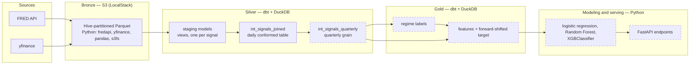

# investment_intelligence_pipeline

- An ELT pipeline with downstream machine learning, ingesting macroeconomic data and signals to classify future market regimes.

The pipeline pulls eight macroeconomic and market series, lands them as Parquet in S3-compatible object storage, conforms and aggregates them with dbt and DuckDB, labels each historical quarter as one of four market regimes, and trains a classifier to predict the following quarter's regime from the current quarter's features. Output is class probabilities across the four regimes, not a hard label.

Status: built and tested through the silver layer (int_signals_joined). Gold models, modeling, orchestration, and serving are in progress

## Architecture

Solid nodes and built and tested, dashed nodes are planned.

## Data

| Signal | FRED/Ticker | Frequency | History from |
|---|---|---|---|
| 2-year Treasury yield | DGS2 | Daily | 1976-06 |
| 10-year Treasury yield | DGS10 | Daily | 1962-01 |
| 30-year Treasury yield | DGS30 | Daily | 1977-02 |
| Fed funds rate | FEDFUNDS | Monthly | 1954-07 |
| CPI (index level) | CPIAUCSL | Monthly | 1947-01 |
| Unemployment rate | UNRATE | Monthly | 1948-01 |
| GDP | GDP | Quarterly | 1946-01 |
| S&P 500 ETF | SPY | Daily | 1993-01 |

Bronze is hive-partitioned by series:
s3://bronze-bucket/fred/series={SERIES_ID}/data.parquet
s3://bronze-bucket/yfinance/series=SPY/data.parquet

## Running the pipeline

Prerequisites:

- Docker and Docker Compose
- Python 3.11+
- A free FRED API key

1. Environment:

Create a .env file in the repo root:

FRED_API_KEY=your_key_here

**LocalStack accepts any credential values**
AWS_ACCESS_KEY_ID=test
AWS_SECRET_ACCESS_KEY=test
AWS_DEFAULT_REGION=us-east-1
AWS_ENDPOINT_URL=http://localhost:4566

BRONZE_BUCKET=bronze-bucket

2. Install:

python -m venv .venv
source .venv/bin/activate        # Windows: .venv\Scripts\Activate.ps1
pip install -r requirements.txt

3. Start object storage:

docker-compose up -d

4. Backfill bronze

python -m setup

5. Transform and test

cd dbt_stuff
dbt run
dbt test

**What you should see**

8 staging models, 1 intermediate model, all not_null and unique tests on "date" columns

## Data Modeling Decisions

Data modeling decisions

The tool choices below are fairly conventional. These decisions are the ones that actually shaped the pipeline.

Signal identity is path-encoded, not stored in the file. Bronze uses Hive partitioning, so series=DGS10 in the path becomes a series column synthesized at read time. In-file series_id and ticker columns were removed as redundant. A column appearing in query results that isn't in the Parquet file is expected behavior, not a transformation bug.

Staging is views; everything downstream is tables. Staging models do a cheap cast-and-rename, so materializing them would duplicate bronze for no gain. The conformed join and gold models are expensive and read repeatedly, so they're tables. The consequence is worth knowing: any connection querying a staging view needs the S3 configuration, because the view re-reads bronze on every query. Materialized tables don't.

Nulls are kept, not filled. The conformed table is at daily grain, so monthly and quarterly signals are null on most rows — CPI is populated on roughly one day in thirty. That's the correct representation of the source data, not a defect, and forward-fill versus leave-null is a per-feature decision made at gold time rather than a blanket policy applied early. This matters more than it sounds: SQL arithmetic propagates nulls, while aggregates and window functions skip them, so the two behave differently over the same column.

## Stack

**Ingestion** — Python · fredapi · yfinance · pandas · boto3/s3fs
**Storage** — Parquet · S3 (LocalStack for local development)
**Query engine + warehouse** — DuckDB
**Transformation** — dbt Core
**Modeling** — scikit-learn · XGBoost (planned)
**Serving** — FastAPI (planned)
**Orchestration** — Prefect (planned)
**Infrastructure** — Docker Compose

## Trade-offs and Decisions

- **Ingestion — `fredapi` + `yfinance`.** Between them they cover every series this
  project needs, with no scraping, no API keys beyond a free FRED key, and no
  vendor cost.
- **Storage — S3-compatible object storage via LocalStack.** Bronze is Parquet in
  an S3 API-compatible bucket running locally, so the pipeline is free to run and
  reproducible on any machine. Real S3 is the deployment path — the code is
  already written against the S3 API, so moving over is a credentials and endpoint
  change, not a rewrite.
- **Query engine + warehouse — DuckDB.** Reads bronze Parquet from S3 directly, so
  there's no load stage between object storage and transforms. Columnar and
  vectorized, which suits a workload that's all full-column scans and window
  functions at single-node scale (~10⁵ rows). No server, no account — the
  warehouse is one file in the repo, so the pipeline is clone-and-run. Mature dbt
  adapter (`dbt-duckdb`).
- **Transformation — dbt Core.** Industry standard, lightweight, runs locally
  against DuckDB, and gives me lineage, `ref()`, and tests without additional
  infrastructure.
- **Testing — dbt tests in silver and gold.** Schema and data tests live next to
  the models they cover, so correctness checks run as part of `dbt build` rather
  than as a separate script.
- **Orchestration — Prefect.** A solo, mostly local project needs a lightweight
  scheduler with minimal setup. Airflow in particular — and Dagster to a lesser
  degree — carries deployment and conceptual overhead that a handful of
  dependent tasks doesn't justify.
- **ML — logistic regression, Random Forest, XGBClassifier.** Logistic regression
  as an interpretable baseline, then tree ensembles to see whether non-linear
  structure earns its complexity. Evaluated on per-class precision and recall
  rather than accuracy, since the classes are heavily imbalanced.
- **Serving — FastAPI.** Prior experience with it, and the surface area here is a
  couple of endpoints returning class probabilities from gold.
- **Infrastructure — Docker and Docker Compose.** Makes the pipeline reproducible
  across machines. Terraform is aimed at provisioning real cloud infrastructure,
  which this project doesn't have.

## Repo Structure

investment_intelligence_pipeline/
├── ingestion/              # source → bronze (extract and load)
├── dbt_stuff/
│   ├── models/
│   │   ├── staging/        # one view per signal
│   │   ├── intermediate/   # conformed daily join, quarterly rollup
│   │   └── gold/           # regime labels, features + target
│   ├── dbt_project.yml
│   └── profiles.yml
├── investment_intel.duckdb # silver + gold warehouse
├── docker-compose.yml      # LocalStack
├── requirements.txt
└── .env

## Limitations

Equity history is much shorter than macro history. Macro series reach back to the 1940s, but SPY only begins in 1993. Any labeling rule that depends on equity returns or volatility can't be evaluated before then, which cuts the usable dataset from roughly 250 quarters to roughly 130. That's a small dataset for a four-class problem, and it constrains how much model complexity is defensible. Extending the equity history with a longer-running index series is the obvious fix.

Crisis is rare by construction. Across the usable window there are only a handful of Crisis quarters. Raw accuracy is therefore a misleading metric — a model that always predicts Bull would score well while catching nothing that matters. Evaluation uses a confusion matrix and per-regime precision and recall.

Release lags are approximated, not reconstructed. The fixed-lag shift is a reasonable first pass, but real publication delays vary and FRED figures are revised after initial release. The model sees final revised values shifted by a typical lag, not the values that actually existed on the prediction date.

FRED returns nulls on non-trading days. The daily Treasury series carry several hundred null values each (DGS10: 719, DGS2: 551, DGS30: 544). This is genuine source data, which is why not_null tests are applied to date columns rather than value columns.

DGS30 has a gap from 2002 to 2006. The 30-year Treasury was discontinued and later reintroduced. The gap is real and left visible rather than interpolated.

Loads are full, not incremental. Every run rebuilds bronze from scratch. At this data volume that's fast and keeps the load trivially idempotent, but it wouldn't scale.

Single-node by design. DuckDB doesn't scale out, there's no concurrency story, and there's nothing for a BI tool to connect to. The .duckdb file is a reproducible build artifact rather than a source of truth — bronze Parquet is, and the warehouse can be rebuilt from it at any time.

This is not a trading signal. The project demonstrates pipeline and modeling engineering. Quarterly regime classification from public macro data is not an edge, and nothing here accounts for transaction costs, slippage, or the fact that regime definitions are themselves a modeling choice.